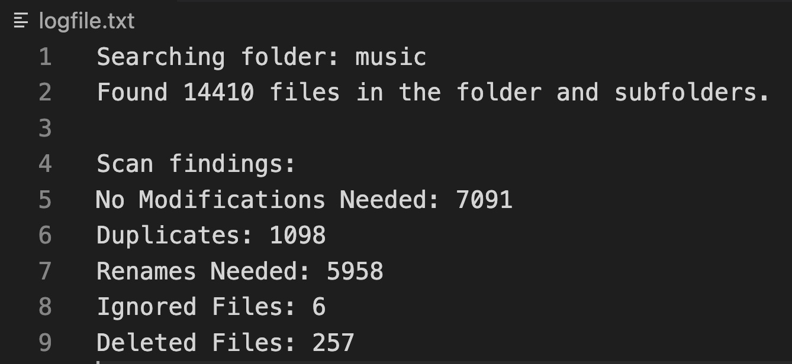
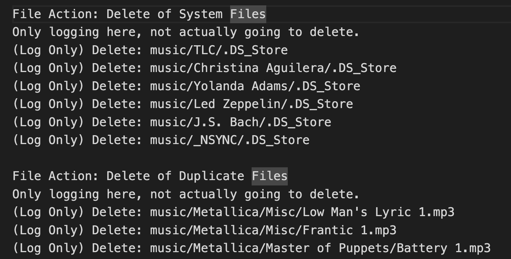
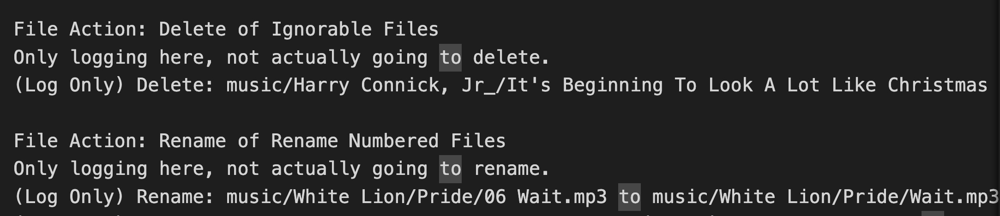
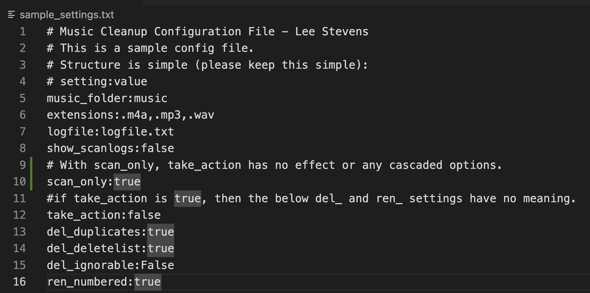

# music-organization

Written by Lee Stevens
Initial Release: August, 2023

So, relax people, we are at 1.0 here, so it's not going to be perfect, but worked great for me.  There's a lot in this readme, but you may find this project useful and entertaining.  If you are learning Python, educational.

This was a project that was started as a "Screw You, Apple" statement after calling their support looking for a "Scorched Earth" way of organizing all of my massive music collection WITHOUT having to manually choose file by file.

I was told by Apple in order to remove duplicates from my library I needed to "Command-Click" every file individually and then delete said entry from the library with no guarantee I wasn't deleting legit entries and files from disk anyway.

After a great workout session for my eyelids rolling my eyes, I determined this was WAY too time consuming as I had over 25,000 entries to delete.  So, this project is 2 separate processes, one to organize files, and another to organize metadata.

By the way, to scorch the data in Apple Music, just go to the song view, select all your songs, and delete from library, and yes, add to the trash.  Hope you read this part before doing the former...  You better have a backup of your file system with all your music in it first.  :)

# Before you begin - IMPORTANT

## This is a powerful piece of code, and will screw you over if you let it and are not careful, keep reading below.  I know we all hate text walls, but it will be the difference in swearing by me rather than at me in the future.

This code was written for me, and as such I have no regard for you or your situation.  I was out to solve my own problem, as you are out to solve yours (or stalk my repository looking to steal code).

As a result, make sure you have multiple backups of your collection, as you are likely going to screw something up.  This is not a challenge or a call to be better, this is a simple warning not to be stupid.  I won't be liable for your stupidity, lack thereof, or any emotion besides gratitude you have for this free code I'm giving to the world of my own kindness.

# The problem statement

### With the file system:

- Too many excess files - I had m4a and mp3 files duplicated in multiple places.
- I had files that were stacked from "auto-copies" such as: "My Song.mp3" and "My Song 1.mp3" and "My Song 2.mp3" and so on.
- Once going to a Mac, the .DS_Store file loves to find its way places.

### With the Metadata:

- Too much going on in the Metadata to speak of.
- Too many "like" entries as artists, such as Artist 1 would be teamed with Artist 1/Artist 2 and so forth, so it led me to have multiple artists which were really the same artist.
- Too many "Unknown" or "Various" artists, so clean them up and change the metadata to add them to the MP3 metadata.  After all, who doesn't love organizing with every box marked "Miscellaneous"?  Yeah, didn't think so.
- Often, a "Various" or "Sountrack" had identification data from its composer.  Use that info to keep it from the "Various" bucket as much as possible.
- Almost ALL my files have a number (track) preceeding them.  This may be okay in the file system, but I use a streaming service where if I want to delete a file from the server, I need to know the preceeding track + file name to find it easily.  Screw that, just remove the leading numbers.  Not fool proof, but I am fine with a few song casualties out of tens of thousands.
- When there is no artist or album artist (contributor) available, keep it from going "Unknown" by using the parent folder name.  The name is organized as such:  Root / Artist / Album / Song
- Some artists have improper capitialization

I'm sure more will come up over time, but this is my first thoughts.

# The real problem statement

I am someone who badly neglected their digital music collection for over 20 years, so now enough is enough.

# Dependencies

There is one dependency, music_tag which is installable by pip.  This is only needed if you want to do the MP3 tagging.  It is part of the file_tags.py file, and kept it away as a shared component.  Then again, if you don't want to do MP3 tagging, why are you using this repo or wanting this code?

Well, the file cleanup is free from needing music_tag at least.

# Lastly...

Enjoy the code, but again, don't just run it.  If bad things happen to you, I will laugh at your complaints and cries.  If you were stupid enough not to play with safe data, there is really no hope for you or your music collection.  Did I drive that home enough?

It is my hope this code will be a benefit to you, and to those of you learning Python, something to learn from.

# Screenshots of use/features

This is what the main scan-only option looks like.  It will go through and look for duplicate files, files that may need renaming, etc.  Scan-only will only give you statistics.

The logging only mode will actually go through and give detailed analysis of what needs to happen.  Known as "take_action" in settings, if it set to false, then it will enter a logging only mode.  It will do everything except actually take a file action.

The settings are configured in a simple text file (included as a sample in the repo)

# Changes / Suggestions
Since there is not much to change yet, I'll leave this blank for now.

# How to use

The v1 of the script has the following files you will need:

### Code files:
- duplicate_files.py
    
    This is the script which removes duplicate files, finds system files, and looks for numbered tracks.

- file_tags.py
    
    This is the script which analyzes your files and then determines how to tag them.

- shared.py
    
    This is where I put common code so I wouldn't write anything twice.

### Configuration Files

- settings.txt

    This is the main settings file.  There are comments documenting its use in the file, and a sample of said file is included.

- safe_artists.txt

    This file is intended to skip any artists from being separated by delimeters.  For example if "Me & Myself" is a proper band name, you can put this in the file so that it would be skipped and not reduced to "Me" at the & symbol.

    Artists are placed into this file one per line.

- final_clean.txt

    This is the last part of the tagging process.  It is meant to fix issues on a larger scale with artist names.  You can replace an entire artist name or just the artist if another string is involved (be careful not to be too vague).

    Instructions are placed one line per item, delimited by || for the action, what to change, what to change it to.

    This is intended to correct case/capatalization.  So, what to replace is case insensitive.  It is all coverted to lowercase.  What to replace it with is case sensitive.

    For example: I want to replace artist name "Me & Myself" with "Me and MYSELF".  I would use "replace||Me & Myself||Me and MYSELF" in the line.

    If I am looking for any artist within a certain string, such as "Me &" with "Me, Myself, and I", then use: "in||Me &||Me, Myself, and I".  Be careful not to be too vague here or it can have some very undesirable results.

# The flow of how it is supposed to work

You should first run the duplicate files script to clean out any excess files you need.

### Duplicate File Script:

- Read the settings from the settings file
- Determine if action needs to be taken when the time comes from settings.
- Catalog all of the files, separating them into OS files that can be deleted, files that don't match configured extensions, find duplicate files, and look for "numbered track files"
    - Duplicate files are determined if a file, say "My Song.mp3" also has a "My Song 1.mp3" in the same folder.  This is generally a sign of neglect and what some media organizers did to keep from deleting files.  You can't blame them.
    - Numbered track files have a leading number: So "05 My Song.mp3" would be reduced to "My Song.mp3".
- If scan_only is set to false, then the script will continue with file operations.
    - Note if scan_only is set to true, then any cascaded action like take_action or any of the file delete/rename settings will take effect.
- If take_action is set to true, I hope you meant it, because file deletes and renames will be happening.
    - If take_action is set to false, then the script will go into logging mode so you can see what might happen as a result of running the script.

### File Tagging Script

- Reads in the shared settings
- Determines if there will be any action performed.  In all reality, scan_only and take_action have the same functionality in this script.  To turn actions off, either scan_only has to be true or take_action has to be false.
- Catalogs the files per extensions - however, no cleaning happens in this script, just the files not meeting said extensions are ignored.
- Processes the tags, and a lot happens here:
    - First, metadata is extracted: artist, albumartist, and title (title more for logging)
    - The artist is then determined by these rules, assuming artist is not a substring of albumartist:
        - Artist wins: If there is an artist, and not an albumartist
        - Folder wins: The folder containing the track wins if there is no artist or albumartist in the metadata.  The folder is determined as this: (Resolves to "The Artist" as the folder structure should go /root/Artist/Album/Track in /root/The Artist/The Album/The Track.mp3)
        - Album Artist wins: If the text 'unknown' comes up in artist and not in albumartist (but something is in albumartist), otherwise artist wins.
        - Artist wins: If both artist and albumartist are populated and not the same.
        - Case is then checked, and that is another set of rules.  Not foolproof, but can be remedied inthe final_clean.txt file.  So 'camelcase' it there if you want.
        - Lastly, if the two match, make sure to parse at delimeters to only return the first artist.  Nobody in their right mind enjoys seeing 5 entries for the same artist and one song in each of the other 4 because they did a song with someone else.  Delimiters can be configured in the main settings under delims.
    - After all that, the final cleaning of the artist happens.  This is where you can replace an artist based on exact match or substring.
    - Then, and only then after that, the resolved artist is returned.
    - I set the artist and albumartist to the same entry so my Apple Music looks cleaner.

# Known Issues

This script is not multithreaded, so it may take a couple of runs to finally delete and rename everything.  Plans are to fix this in the future as time and priorities permit.

# Future Development

I'll work on this as I see the need to or have other tools to add to it.